# Gulab & Co.: handmade mithai website

A mobile-first website for a traditional Indian sweet shop in Bengaluru. Customers browse the sweets, build a festive **dabba** (gift box), and send their order to the shop on **WhatsApp**. No backend, no database and no monthly cost.

> **Design preview.** Gulab & Co. is a fictional brand. The shop name, address, phone numbers, reviews and story are placeholders, made to show a local sweet shop what its own site could look like.

### 🔗 Live demo: [gulab-and-co-sweet.vercel.app](https://gulab-and-co-sweet.vercel.app/)

Best viewed on a phone, but it works on desktop too.

---

## Screenshots

### On a phone

<p align="center">
  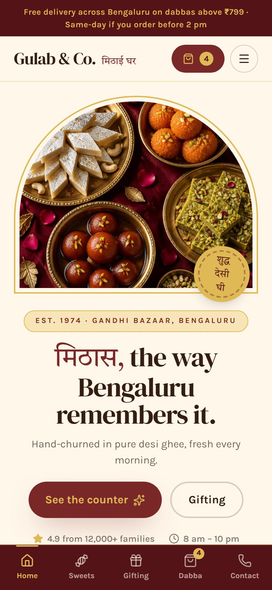
  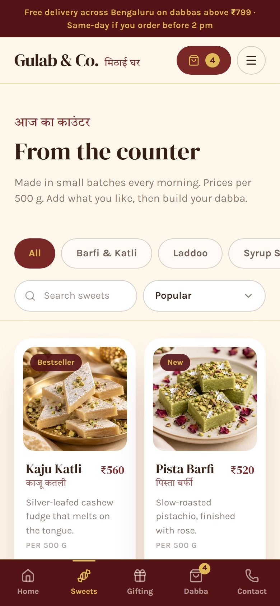
  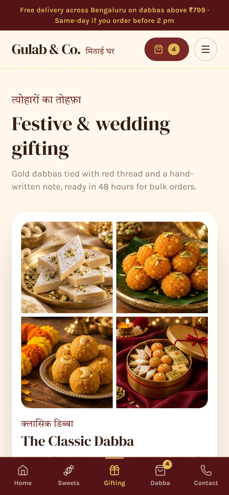
  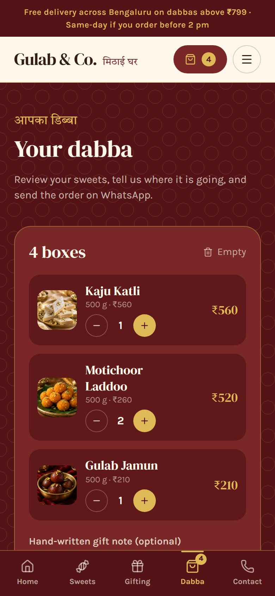
  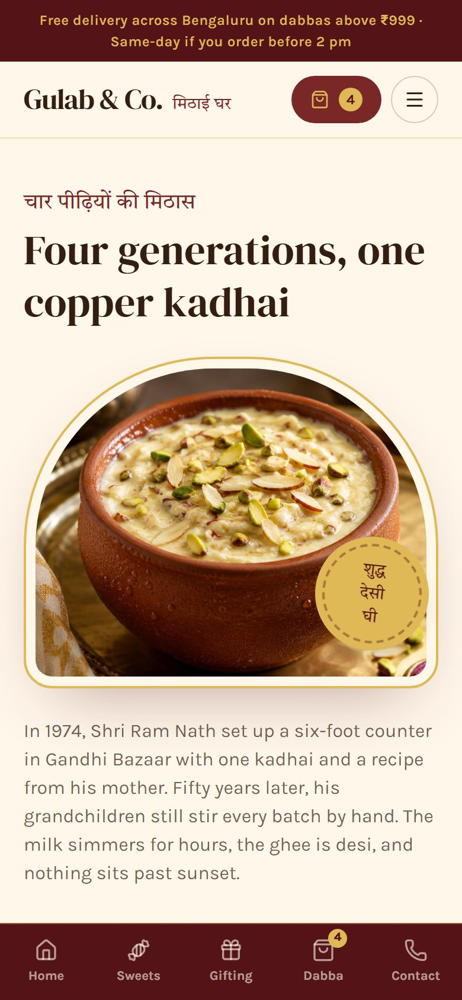
</p>

### On desktop

**Home**

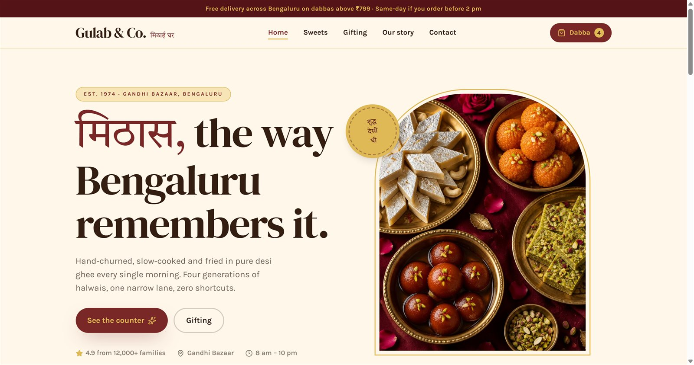

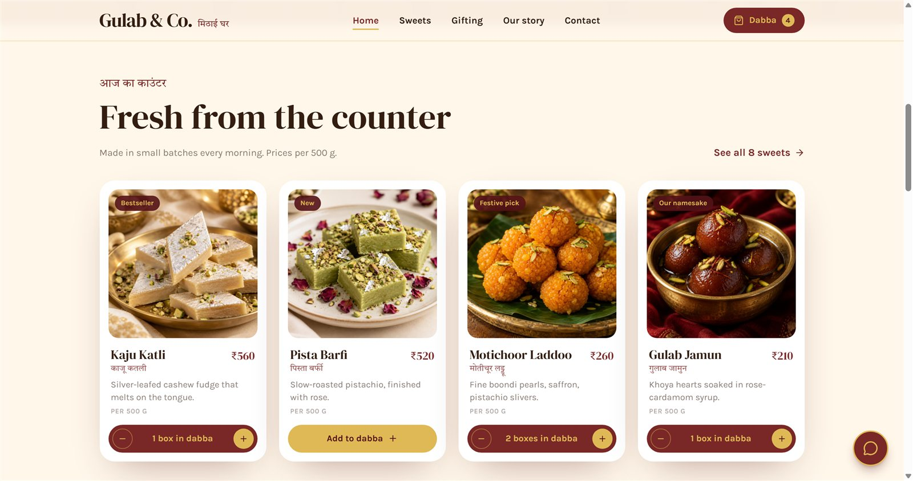

**Sweets**: filter by category, search, sort, and add boxes to the dabba

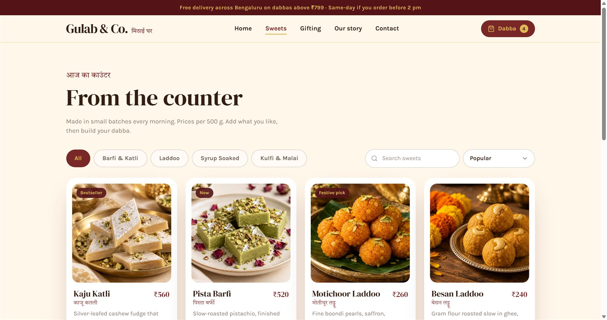

**Festive & wedding gifting**: ready-made dabbas that add to the cart in one tap

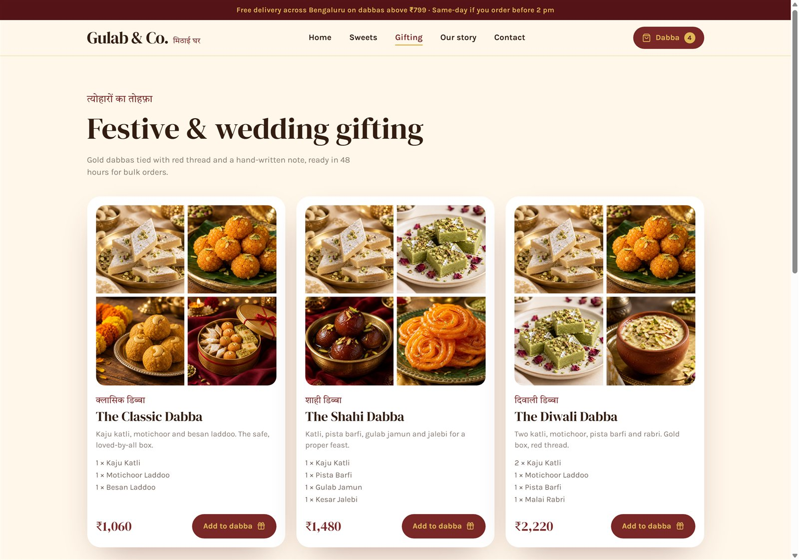

**Bulk & wedding orders**: a quote form that opens WhatsApp with the details filled in

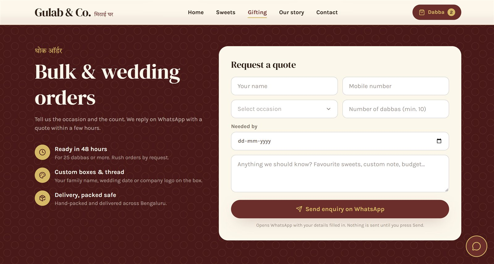

**Our story**

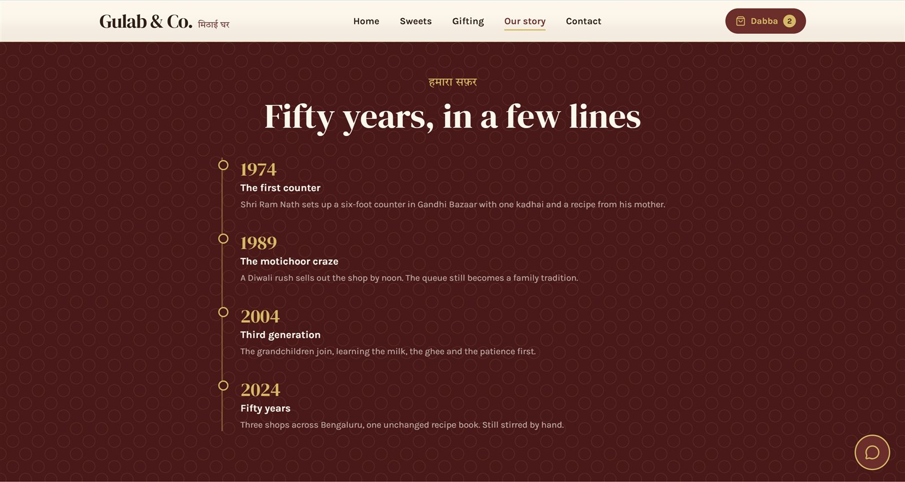

---

## What's inside

| Page | What it does |
| --- | --- |
| **Home** | Hero, scrolling promise strip, featured sweets, ready-made dabbas, reviews, bulk-order banner |
| **Sweets** | All sweets with category chips, search and sorting. Add or remove boxes right on the card |
| **Gifting** | Three ready-made dabbas (add to cart in one tap) and a bulk / wedding quote form |
| **Our story** | The shop's story, a timeline and what it never compromises on |
| **Contact** | Address, live "open now" badge, opening hours, map, call and WhatsApp buttons |
| **Your dabba** | Cart and checkout: pickup or delivery, gift note, delivery fee, then send on WhatsApp |

**Highlights**

- 📱 **Mobile first**: bottom tab bar and thumb-friendly buttons on phones, a top navigation bar on desktop
- 💬 **WhatsApp ordering**: the order is typed out as a message and WhatsApp opens ready to send. It's free and needs no account or API
- 🎁 **Dabba builder**: the cart remembers its contents if the page is refreshed
- 🚚 **Delivery rules**: free delivery above a set amount, otherwise a flat fee, with a "add ₹X more for free delivery" nudge
- 🇮🇳 **Indian look and feel**: maroon and gold palette, Hindi accents, a jaali (lattice) pattern, an arched hero frame and a *शुद्ध देसी घी* seal
- ♿ **Accessible basics**: labelled buttons and form fields, visible focus outlines, and animations that respect "reduce motion"

## Built with

- [React 19](https://react.dev) and [Vite](https://vite.dev)
- [Tailwind CSS 4](https://tailwindcss.com)
- [lucide-react](https://lucide.dev) icons
- Google Fonts: DM Serif Display, Karla and Tiro Devanagari Hindi
- A small built-in router (no routing library), deployed on [Vercel](https://vercel.com)

## Run it locally

You need [Node.js](https://nodejs.org) 22 or newer.

```bash
npm install
npm run dev        # http://localhost:5173
npm run build      # production build goes to /dist
npm run preview    # preview the production build
```

To try it on your phone, run `npm run dev -- --host` and open the "Network" address it prints (your phone must be on the same wifi).

## Re-skin it for another shop (about an hour)

Everything shop-specific is in a few places:

| What to change | Where |
| --- | --- |
| Name, address, phone, **WhatsApp number**, email, hours, map, delivery rules, announcement bar | `src/config/shop.js` |
| Sweets, prices, categories, ready-made dabbas | `src/data/sweets.js` |
| Photos | `public/images/` (keep the file names, or update the paths in `sweets.js`) |
| Colours and fonts | the `@theme` block at the top of `src/index.css` |
| Story, reviews and other copy | `src/pages/Story.jsx` and `src/pages/Home.jsx` |

Things to do before using it for a real shop:

1. Put the shop's real **WhatsApp number** in `shop.js` (country code and number, no `+` or spaces, e.g. `919845012345`).
2. Replace the sample reviews, the story and the "4.9 from 12,000+ families" line with the shop's real details.
3. Swap in the shop's own photos.
4. Set `demoMode: false` in `shop.js` to remove the "design preview" notes.

## How an order reaches the shop

Tapping **Send order on WhatsApp** opens WhatsApp to the shop's number with the whole order typed out (a reference like `GC-7K2F`, items, quantities, total, name, phone and address). The customer only has to press Send. Payment is on pickup or delivery.

**By default nothing is stored on a server, so the shop receives the order only when the customer presses Send in WhatsApp.**

### Optional: orders into a Google Sheet, with an email alert

For a real shop you can also record every order in the owner's **Google Sheet** and email the owner. This works even if the customer never presses Send in WhatsApp. It's free and has no backend to host. The Apps Script and the 15-minute setup guide are in [`apps-script/`](./apps-script/SETUP.md):

- an **Orders** tab (newest order on top, with a Status dropdown) and a live **Today** tab
- an email to the owner for each order
- a secret token, a hidden trap field, input checks, duplicate and rate limits, and protection against formulas being planted in the sheet

**What the shop owner sees:** each order is a row in their sheet, newest on top (names and numbers below are test data):

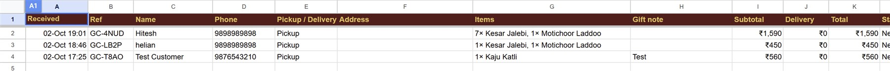

It's off unless the two environment variables `VITE_ORDERS_ENDPOINT` and `VITE_ORDERS_TOKEN` are set (see `.env.example`), so this public demo never writes anywhere.

## Deploy

The site is a plain static build, so any static host works. On Vercel or Netlify (both have free plans):

- Build command: `npm run build`
- Output directory: `dist`

The pages use clean URLs like `/sweets`, so the host must send every path to `index.html`. That is already configured: `vercel.json` for Vercel and `netlify.toml` for Netlify.

## Project structure

```
src/
  config/shop.js        shop details and delivery rules
  data/sweets.js        sweets and ready-made dabbas
  pages/                Home, Sweets, Gifting, Story, Contact, Dabba
  components/           Layout (header, tab bar, footer) and shared pieces
  state/CartContext.jsx the dabba (cart) state
  lib/                  router, the WhatsApp order message and the optional sheet hook
apps-script/            optional Google Sheet + email order intake (Code.gs and SETUP.md)
public/images/          photos
screenshots/            images used in this README
```

## Notes

- Prices are per 500 g box, in ₹.
- The phone numbers, email, address, reviews, story and ratings are **placeholders**.
- The photos come from the original design mock. Use the shop's own photos for a real client.
- Icons are by [Lucide](https://lucide.dev), and the fonts are from Google Fonts.
